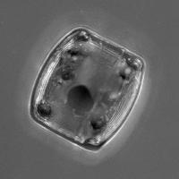
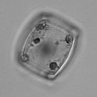
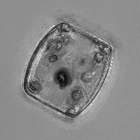

=================================
Tutorial: Extended Depth of Field
=================================

This is an example of how to use mahotas to implement an algorithm that it does
not have built-in: *extended depth of field*.

The idea is that you have a stack of images, taken at different focal points,
and you build a single image so that you get everything in focus.

Start with standard imports::

    import numpy as np
    import mahotas as mh

We are going to assume that you have an ``image`` object, which has three
dimensions: the stack, height, and width::

    stack,h,w = image.shape

We use ``mh.sobel`` as the measure of "infocusness" for each pixel [#]_::

    focus = np.array([mh.sobel(t, just_filter=True) for t in image])

Now, we select the best slice at each pixel location::

    best = np.argmax(focus, 0)

So far, very easy. The next part is the hard part. We want to do the
following::

    r = np.zeros((h,w))-1
    for y in xrange(h):
        for x in xrange(w):
            r[y,x] = image[best[y,x], y, x]

But this is very slow (never run nested loops in Python if you can avoid it).
We get the same result with a slightly less legible, but faster manipulation
[#]_::

    image = image.reshape((stack,-1)) # image is now (stack, nr_pixels)
    image = image.transpose() # image is now (nr_pixels, stack)
    r = image[np.arange(len(image)), best.ravel()] # Select the right pixel at each location
    r = r.reshape((h,w)) # reshape to get final result

Et voilà!

Here is an example, from a stack of microbes imaged. This is is the maximum
intensity projection:

This is the *most in-focus slice* (using the sobel operator as the measure):

And this is the extended depth of field result:

It is clearly sharper, perhaps at the expense of some possible noise. I
actually played around with blurring the image a little bit and it did improve
things ever so slightly.

.. [#] Other methods simply use a different measure here.

.. [#] I am not 100% convinced that this is the best. After all we create an
   array of size ``len(image)`` just to index. I would be happy to find an
   alternative.

