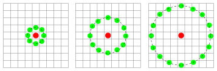

=====================
Local Binary Patterns
=====================

Local binary patterns depend on the local region around each pixel. See the
diagram below:

(Image reference: `Wikipedia <http://en.wikipedia.org/wiki/Local_binary_patterns>`__)

The reference pixel is in red, at the centre. A number of points are defined at
a distance ``r`` from it. These are the green points. As you go from left to
right, the number of green points increases.

The "pattern" in the name is the relationship of the value at the green points
when compared to the central red point. We call it a binary pattern because all
that is taken into account is whether the value at the green point is greater
than the value at the red point.

As you can see, the green points do not necessarily fall exactly on another
pixel, so we need to use interpolation to find a value for the green points.

API Documentation
-----------------

The ``mahotas.features.lb`` module contains the ``lbp`` function which
implements LBPs.

.. automodule:: mahotas.features.lbp
    :members:
    :noindex:

